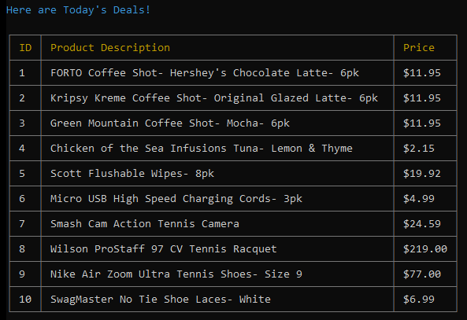
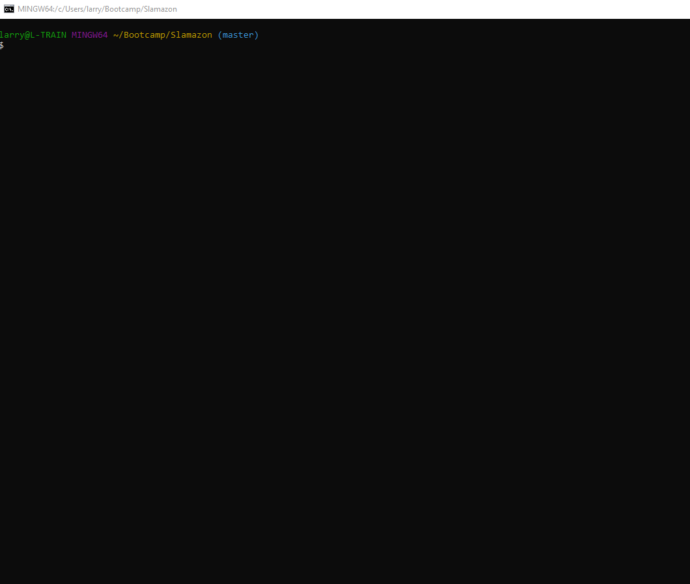

# Slamazon

## About

**Slamazon** is a **Node.js** and **MySQL** powered CLI shopping experience application designed to quench your impulses to shop when you are grinding away in a terminal session.  Other imposters may have the browser shopping market cornered, but **Slamazon** has no competition in the terminal-- don't even think about lame Bamazon.

## How it Works

### The Database

**Slamazon** is supplied thanks to a database called _products_ managed in MySQL.  The _products_ database was seeded by the _slamazon.sql_ file that contains the deals of the day featured in the application.  

Here is a peak into the _products_ database in MySQL immediately after the seeding.

### User Experience 

When the customer begins the shopping experience by executing the _slamazonCustomer.js_ file in Node within the terminal, the file accesses the _products_ database and builds a table of "Today's Deals" to present to the customer in the terminal.  Today's Deals are presented in a slick front end interface using the _CLI Table_ npm package which additionally leverages the _colors.js_ npm package to bring the vibrant colors the user will in the terminal session which are so inviting it might cause shoppers to forget about the browser all together!  Shoppers will definitely forget about the stone age black and white experience on Bamazon. 

After reviewing Today's Deals, the shopper is asked to enter the ID of the product and then quantity of the product they wish to purchase thanks to the _Inquirer_ npm package.  Here is a demonstration of the ease of the buying experience.  After a purchase is successfully completed, the shopper is presented with a confirmation message and a summary of the purchase, including the final total price.

Once a quantity of product is purchased, _slamaonCustomer.js_ updates the stock totals in the _products_ database in real time.  In the previous demonstration, the shopper purchased the final unit in inventory of product ID 9.  You can see the database was updated to reflect there are now no more units in stock.  

When a shopper attempts to purchase a product that is out of stock, or a quantity of a product that is greater than the remaining supply reflected in the database, **Slamazon** provides a notice to the shopper in the terminal and advises on the number of units of the product currently in stock.  The shopper is prompted to press Ctrl+C and initiate a new shopping session if there was not sufficient inventory to fulfill the original order, but there is some level of available inventory for the product.

## Future Releases

Challenges 2 and 3 of **Slamazon** are coming soon!

